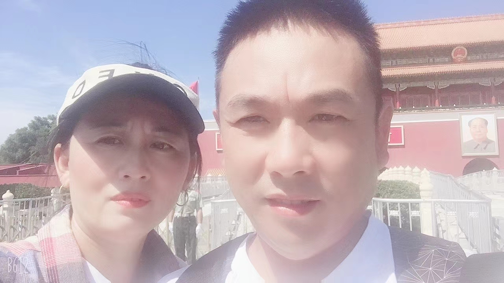

<h1><b>Welcome to Mr.zhang's personal website.</b></h1>
<h2>self introduction</h2>

姓名：张佳军

 
   年龄：19(虚岁二十的我恬不知耻的假装自己是一个小鲜肉）

  
  籍贯：河南商丘虞城（来自小县城的我颤颤巍巍地在北京大学做一个老菜鸡)

   
身高：180cm（理想185cm，嘿嘿！）  体重：70kg(略微有一点肥，努力减肥ing)

   

 

 
<h2>My life experiences</h2>

我出生于河南省商丘市的一个小县城——虞城省，家中共有五口人，爸妈还有我的哥哥姐姐，因而我的家庭生活格外的幸福美满。虽然爸爸为了家庭经常需要外出打工挣钱，但是每次爸爸回来都会带我们去旅游，去吃好吃的，小时候每次爸爸回来的时候都是我最快乐的时候。

 

 
 
  

 
爸妈        哥哥和我      姐姐

初中高中我都是在虞城度过（毕竟咱是在那土生土长的呀），在这里我遇到了很多终生难忘的朋友与老师，在与他们的相处中，我感受到学校的温暖，也正是在他们的帮助下我来到了梦想中的PKU。虽然那里条件一般，但是我很喜欢那里的一草一木，一人一物。

  

 

在高中，最幸运的是我遇到了生命中的那个她，虽然中间遇到了很多困难与矛盾，
 但是终于我们度过了那段朦胧却又美好的高中时光，

 我们都已步入大学，我也终于可以名正言顺地牵着她的手走在大街上，
 满心欢愉洒满漫天星光，虽光阴流逝，岁月变迁，身边人依旧。

 

 

 

 

考入北京大学之后，我在这所全国最好的大学遇到了最好的同学，最好的辅导员，最好的老师，燕园的美使我流连忘返，
   未名湖上微风拂过，荡起水中的博雅塔，庄严肃穆的图书馆透露着北大人严肃认真的学术态度，
 身在燕园，我也被这里浓厚的学习氛围而感染，为自己身为一名北大人而骄傲。
 
  

